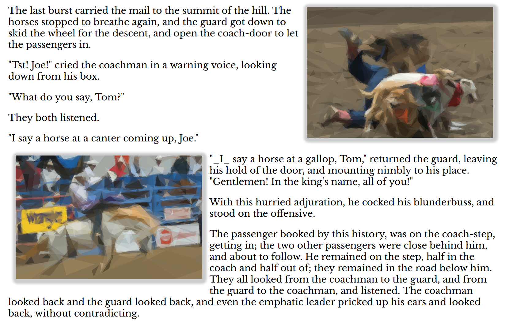
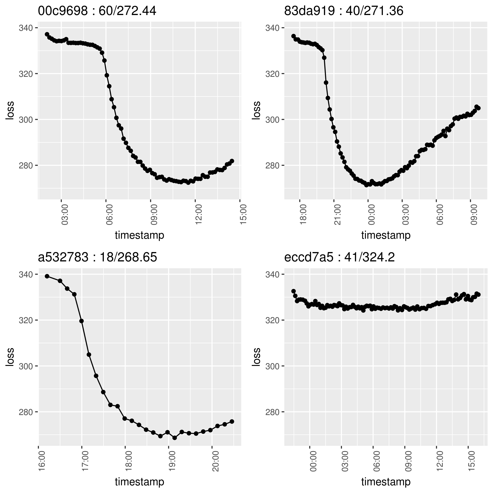
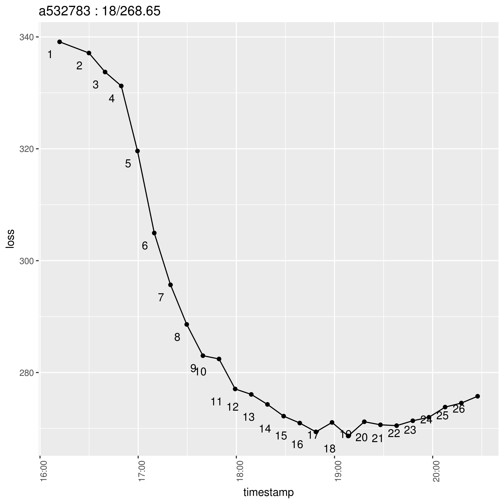

# Storybook Illustrator

This project explores visual storytelling by annotating a narrative with images. Ultimately, the images form a cohesive flow of events described in the text. We use Microsoft Research’s [Visual Storytelling Dataset (VIST)](http://visionandlanguage.net/VIST/) to build a two part network relating images and text descriptions. Once trained, this architecture places appropriate images for unseen text narratives.



## Build Notes

Multiple models were constructed to find the best architecture to relate the text to the images. Models are annotated with the short hash from the relevant git commit. The pair of networks use a cosine loss.




### Jupyter

Modifying the [Jupyter](https://jupyter.org/) installation to produce `.py` and `.html` on Jupyter saves will simplify running and updating of all models. The following instructions are pulled from [Jupyter Notebook Best Practices for Data Science](https://www.svds.com/jupyter-notebook-best-practices-for-data-science/).

First, if the `~/.jupyter/jupyter_notebook_config.py` configuration file does not exist, run `jupyter notebook --generate-config`.

Prepend this python to the configuration file at `~/.jupyter/jupyter_notebook_config.py`.

```python
c = get_config()
### If you want to auto-save .html and .py versions of your notebook:
# modified from: https://github.com/ipython/ipython/issues/8009
import os
from subprocess import check_call

def post_save(model, os_path, contents_manager):
    """post-save hook for converting notebooks to .py scripts"""
    if model['type'] != 'notebook':
        return # only do this for notebooks
    d, fname = os.path.split(os_path)
    check_call(['jupyter', 'nbconvert', '--to', 'script', fname], cwd=d)
    check_call(['jupyter', 'nbconvert', '--to', 'html', fname], cwd=d)

c.FileContentsManager.post_save_hook = post_save
```

### Dependencies

Python dependencies are in the pip3 file `requirements.txt`. Note that nltk requires data files, which are loaded by `python -m nltk.downloader all`. Pytorch will automatically retrieve resnet preloadings on the first run.

### Data

The [Visual Storytelling Dataset (VIST)](http://visionandlanguage.net/VIST/) needs to be downloaded to the local disk and extracted. The location folder must be stored in a plain text file in the project root called `data.directory.txt`.

The final `process_text.py` script also requires the primitive binary to be available in the path. The source is MIT licensed and available on [github](https://github.com/fogleman/primitive). This provides the final post processing of chosen images.

Word embeddings can be downloaded from Google [here](https://drive.google.com/file/d/0B7XkCwpI5KDYNlNUTTlSS21pQmM/edit?usp=sharing) and must be extracted in the root of the **DATA_DIRECTORY**.

The **DATA_DIRECTORY** needs to have the following structure:

```
DATA_DIRECTORY/
┣━━GoogleNews-vectors-negative300.bin
┗━┳━dii/
  ┣━sis/
  ┣━train━images━images┳━image.0.jpg
  ┃                    ┣━image.1.jpg
  ┃                    ┣━...
  ┃                    ┗━image.12.jpg
  ┗━test━━images━test━━┳━image.0.jpg
                       ┣━image.1.jpg
                       ┣━...
                       ┗━image.12.jpg
```

 * `dii` contains the Description in Isolation JSON
 * `sis` contains the Story in Sequence JSON
 * `train` contains the training images, in two subfolders (extracted train_split.*.tar.gz)
 * `test` contains the testing images, in two subfolders (extracted test_split.tar.gz)

The deep folder structure is an artifact of how pytorch's Image Folder considers the assets.

#### ImageMagick Command

```bash
mogrify -path . -resize "224x224^" -gravity center -crop 224x224+0+0 *.*
```
